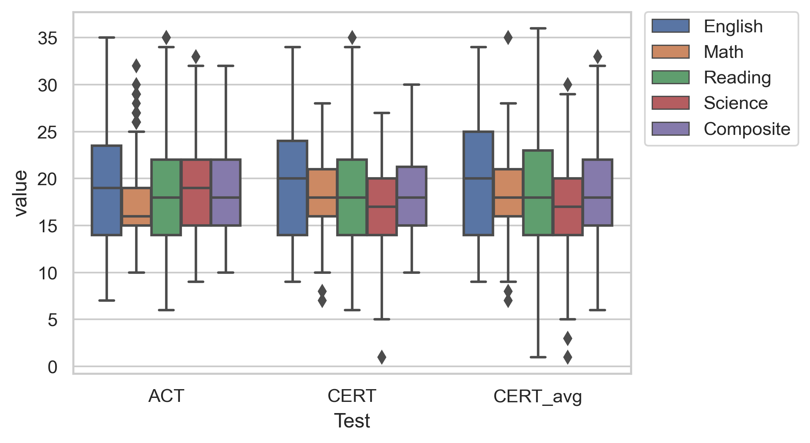
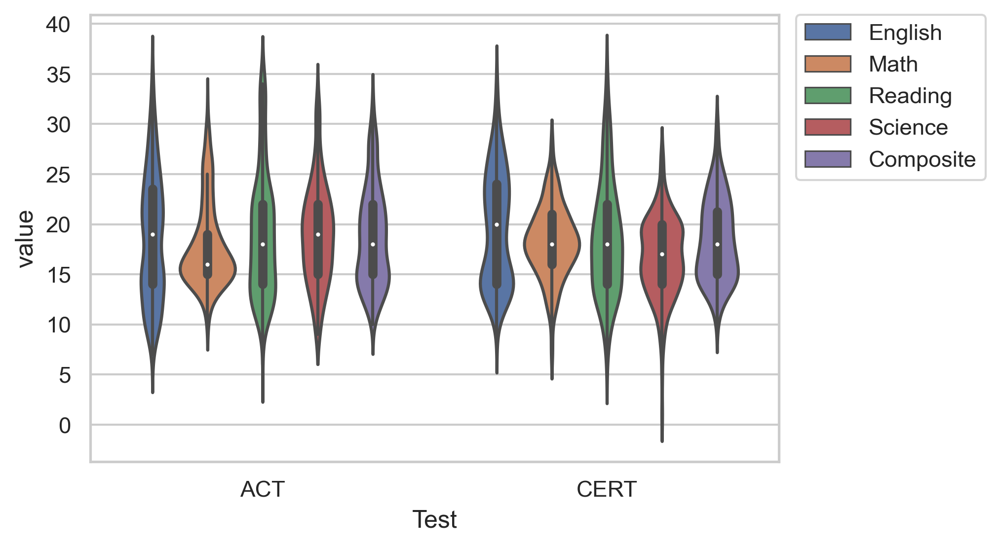

# School_ACTSoftware_Analysis
## Purpose
The purpose of this analysis is to compare students’ scores on a CERT practice ACT assessment with their recent ACT scores in order to determine the validity of using the CERT assessment as a predictor of/prep for Siegel High School’s ACT scores. Additionally, this analysis seeks to clarify what, if any, relationship exists between Seigel High School (SGH) student performance on CERT practice ACT assessment and SGH student ACT scores.    
*Any sensitive information from this report has been removed from all attached documents on this publicly accessible platform.*

## Research Questions
The following research questions were generated to guide the analyses and were decided upon by committee in order to qualify differences between sets of data. 
<ol>
    <li>Does SGH ACT score (average) match the schoolwide CERT score?</li>
    <li>On a student-by-student basis, are SGH student ACT scores significantly different than their corresponding CERT scores?</li>
    <li>Are there particular subgroups of the school, or subtests of the ACT, for which the CERT assessment is (more) accurate and precise? (I.e., for English department, female students, those taking honors math/English, etc.)</li>
    <li>Is the distribution of ACT scores for SGH students different than the distribution of CERT scores?</li>
    <li>Are there correlations between students’ CERT scores and ACT scores?</li>
    <li>Can a predictive model be created using the subsets of the CERT assessment data to predict how a student may have performed on their ACT test or subtest? (If so, is the model strong?</li>
</li> 

## Constraints
It should be noted that the CERT assessment was administered after the real ACT test for the participants, and it was administered under less strict testing environments. This study is limited to less than 400 participants from a single cohort. Many records were dropped for certain tests given that a number of students took the ACT but did not take/complete the CERT test. Initial analyses filled in missing CERT subtest scores with the projected CERT composite score to add more records for analysis. This addition actually led the data to more closely reflect the ACT data. Given the extreme circumstances of this past year, I elected to go with the more restrictive data set in order to be more confident of what resulted from analyses and reduce biases. Given the relatively small set of data, any predictive model will likely be severely limited in usefulness or generalizability. Additionally, creating a machine-learning model to work with this data is time-consuming and dependent upon resources. 

## Visualizations
Showcasing the distributions with boxplots and violin plots. 

    
    

## Next Steps
<ul>
    <li> Streamline code into a tidy single program for future use.</li>
    <li> Collect additional data and repeat analyses for validity.</li> 
    <li> Begin gathering/identifying requisite resources for structuring a ML algortihm to predict student performance on the ACT from their CERT practice assessments.</li>
    <li> Find additional sets of data for a more diverse set, promote analyses to other schools in district.</li>
    <li> Long-term: asuming collaboration and additional resources are available, consider formal study for testing predictive model.</li>
</ul>